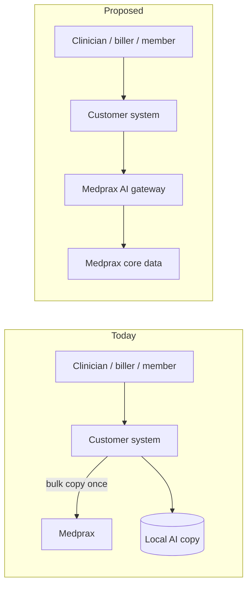

# Medprax in the AI era — paths to protect (and grow) the moat

**Audience:** Medprax product & commercial leadership
**From:** Fleming
**Status:** Discussion draft for joint review

---

## 1. Executive summary

The shift to AI changes one thing fundamentally for any reference-data business: a customer can pull your data once into an AI system and never come back. The recurring relationship that underwrites Medprax's commercial model collapses the moment your data is treated as a one-time bulk source for an offline copy.

This is not a hypothetical. It is already how vendors, hospital groups, and dispensing platforms are being told to "do AI" — point an AI tool at a data source, copy the answers into their own system, and run from there. Without action, that path leads predictably to commoditisation of the Medprax catalogue.

We propose a combined response, ranked from defensive to ambitious:

- **Tighten** the existing data services against silent bulk copying (mandatory floor).
- **Ship a Medprax AI gateway** so every AI-driven query inside a customer's product calls Medprax in real time, instead of a stale local copy (recommended).
- **Launch Medprax-branded AI products** — semantic medicine search, benefit explanations, code suggestions — sold to practices, hospitals, schemes, and the vendors who serve them (headline recommendation).
- **Offer a private deployment** for the largest customers who cannot send queries outside their network (optional, on demand).

Fleming offers to be Medprax's **launch pilot**. We already use Medprax in production for medicine, NAPPI, scheme, plan-option, and tariff data, and we want Medprax to remain the source of record as our clinical and revenue products move toward AI-assisted workflows.

---

## 2. What's actually at risk

The risk is best understood by who is doing the copying and what they get out of it.

| Who | What they do today | What it means for Medprax |
|---|---|---|
| **Vendors and platforms** (EHRs, dispensing systems, billing tools) | Pull the Medprax catalogue once into their own system, refresh occasionally. | The recurring relationship turns into a one-off, and renewals get harder each year. |
| **Hospital groups and large practices** | Build internal AI copilots over local copies of medicine, tariff, and scheme data. | Medprax becomes invisible inside the workflows where its data matters most. |
| **Medical schemes** | Use AI to answer member benefit questions from their own internal version of plan-option data. | Plan and benefit data — a Medprax strength — gets re-published without attribution. |
| **AI clients in general** (chat assistants, copilots) | Paste Medprax responses into prompts that are logged or cached by third parties. | Data leaks outside the Medprax perimeter without anyone intending it. |

The areas of the Medprax catalogue most exposed today are the ones that are easiest to copy in bulk: the **medicine and NAPPI catalogue**, the **scheme and plan-option directory**, and the **tariff and contract pricing data**. The behavioural products — anything that *suggests* (medicines from a clinical note, codes from a description) — are also exposed, because they are the most attractive to imitate.

---

## 3. Design principles

Four principles inform every option below:

1. **Freshness is the real moat, not the rows themselves.** Anything that is copied goes stale. The right response makes freshness structural, not contractual.
2. **Make the right thing the easy thing.** A customer that *prefers* calling Medprax won't copy. Good experience beats legal threats for compliance.
3. **Detection beats prevention.** Pair contracts with telemetry that surfaces unusual usage patterns early.
4. **Move up the stack.** Reference data is being commoditised. Curated answers on top of that data are not. Sell answers, not just rows.

---

## 4. The four paths

For each path: *what it is, who it suits, what Medprax gains, effort.*

### Path A — Harden the existing service (defensive floor)

- **What:** Per-customer query budgets, usage telemetry, watermarking that lets Medprax recognise its own data in the wild, and explicit no-copy / no-train clauses in every contract together with a mandatory refresh policy.
- **Who it suits:** Every existing customer. This is the floor — not optional.
- **What Medprax gains:** Visibility, evidence, and legal recourse when the catalogue ends up somewhere it shouldn't.
- **Effort:** Weeks. Mostly platform and legal work; no new product.
- **Limit:** Buys time. Doesn't change the trajectory on its own.

### Path B — Medprax AI gateway (recommended)

- **What:** A single Medprax-operated layer that AI tools — inside vendor products, hospital systems, or scheme portals — call directly whenever they need a medicine, tariff, scheme, or benefit answer. Customers integrate once; their AI queries hit Medprax in real time instead of a stale local copy.
- **Who it suits:** Any customer building AI features, which over the next 18 months means most of them.
- **What Medprax gains:** Real-time visibility into how AI is using its data, structural freshness (every AI turn is a live call), and brand presence inside customer products via attribution.
- **Effort:** Medium. The work is in the product surface and quotas, not the underlying data.

**Why this matters most strategically.** When AI tools call Medprax every time, the incentive to keep a local copy disappears. Freshness becomes a feature of the service, not a clause in a contract.

### Path C — Medprax-branded AI products (headline recommendation)

- **What:** Medprax does the AI work itself, behind its own products. Sells *answers*, not rows. Three concrete first products:
  - **Smart medicine search** — natural-language search returning ranked NAPPI candidates with reasoning, sold to dispensing platforms and EHRs.
  - **Tariff suggestion** — turns a clinical note plus discipline into suggested tariff codes with confidence, sold to billing systems and practices.
  - **Benefit explainer** — turns a scheme + plan + procedure into a plain-language benefit answer, sold to schemes for member-facing use and to vendors for in-product checks.
- **Who it suits:** EHRs, dispensing systems, schemes, hospital groups, and any vendor who would otherwise build their own AI layer over Medprax data.
- **What Medprax gains:** A new, premium product line. Repositions Medprax from "data provider" to "clinical knowledge service." Removes the *incentive* for customers to copy and embed, because Medprax already did it better and is responsible for keeping it accurate.
- **Effort:** Larger. Requires an AI delivery capability (built in-house or with a partner) and a credible evaluation methodology — see §7.

### Path D — Private deployment (on demand, advanced)

- **What:** For the largest customers — major schemes, hospital groups — who require that their data not leave their network, offer a Medprax-operated deployment inside the customer's own environment. Queries stay local; Medprax retains control over refreshes and rotation, and can revoke access on contract end.
- **Who it suits:** Top-tier customers with hard data-residency or sovereignty requirements.
- **What Medprax gains:** Access to the largest contracts that would otherwise refuse a hosted service.
- **Effort:** Significant. Worth building only once a named customer has signed a term sheet contingent on it.

---

## 5. Commercial model sketch

A tiered structure that lets every existing customer stay where they are, while opening new revenue:

| Tier | What it includes | Pricing shape |
|---|---|---|
| **Lookup** (today) | Existing reference-data services. | Unchanged. |
| **AI gateway** | Real-time AI access with quotas, usage telemetry, attribution in customer products. | Premium over Lookup, or seat-/workspace-based. |
| **Medprax AI products** | Smart medicine search, tariff suggestion, benefit explainer. | Per-answer, premium tier. |
| **Private deployment** | Medprax-operated deployment inside a customer's own environment. | Annual licence + ops fee. |

Cross-cutting:

- **AI-rights addendum** in every contract — explicit terms on copying, training, and derivative use. Today's contracts almost certainly do not address these clearly.
- **Revenue share** with vendors who surface Medprax-branded answers in their products. Aligns incentives so vendors prefer attribution over re-publication.
- **Pilot pricing** for the first one to three launch partners — Fleming volunteers as one.

---

## 6. Pilot proposal with Fleming

We already use Medprax across the clinical and revenue parts of our platform — for medicine, NAPPI, scheme, plan-option, and tariff data. We want Medprax to remain that source of record as we move our products toward AI-assisted workflows, and we are willing to put real engineering and customer access behind that.

**Proposed 90-day pilot:**

1. *Joint design sprint, week 1.* Agree on the first AI gateway shape and the first two Medprax AI products.
2. *Private alpha, weeks 2–6.* Medprax ships an initial AI gateway and one AI product (we suggest tariff suggestion).
3. *Live integration, weeks 4–10.* Fleming runs it inside our clinical and revenue products alongside our existing Medprax integration, with feedback loops.
4. *Joint review and case study, weeks 11–12.*

**What Fleming commits:** design partner role on the product shape; anonymised usage data, on agreed terms, covering how clinicians, billers, and front-desk staff actually use AI against Medprax data; a public case study and quote at launch.

**What Medprax commits:** design partnership on the AI gateway and first AI products; pilot pricing; a named technical and commercial contact; roadmap visibility for the AI-rights addendum.

---

## 7. Things to consider — open questions for joint discussion

These are the items most likely to be missed in a "just turn on AI" framing. Each deserves an explicit Medprax position before any AI product ships.

- **PoPIA and HPCSA exposure.** When Medprax answers participate in a clinical decision, who is the responsible party — the vendor, the clinician, or Medprax? A clear position is needed before any AI product goes live.
- **SAHPRA and clinical-decision-support classification.** An AI product that *suggests* medicines from a clinical note may cross from "reference data" into regulated clinical decision support. Worth a regulatory pre-read now, not after launch.
- **Route-around risk.** If Medprax does nothing, customers will (a) copy what's available today, (b) buy from a competitor, or (c) build a "good enough" cache from public sources. Inaction is not neutral — it cedes the AI-era position to whichever competitor moves first.
- **What "unusual usage" looks like.** Medprax should have a clear internal definition of patterns that suggest copying versus legitimate clinical use, before signing the next round of contracts.
- **Refresh cadence as a contract term.** Every licence — Lookup, AI gateway, AI products — should make refresh frequency explicit. Stale data is the primary harm of copying, and freshness obligations make copying commercially unattractive.
- **Per-customer attribution and visibility.** When a vendor like Fleming serves dozens of practices through one integration, Medprax needs a clear position on whether per-practice usage is visible — it is both a feature (better telemetry, per-practice billing) and a privacy question.
- **Backwards compatibility.** Existing customers on the Lookup tier must not break. The AI gateway and AI products are strictly additive, with no forced migrations.
- **Build vs partner.** Does Medprax build the AI delivery capability in-house, partner with an AI provider, or co-build with a launch partner? Each has different speed-to-market and IP-control trade-offs.
- **Pricing anchor.** Per-answer pricing for AI products needs a defensible reference point — without one, customers will push back at every renewal.
- **Competitive landscape.** What is MIMS, SAMF, and other formularies doing on AI? Medprax has a window to set the standard for South African medical reference data in AI workflows. That window is not open indefinitely.
- **Branding inside customer products.** When a customer's AI tool gives a medicine, tariff, or benefit answer, can Medprax require attribution — "Source: Medprax" with a freshness date? This is both a moat (visibility) and a quality signal (provenance).
- **Evaluation and safety.** Before any clinical AI product is generally available, Medprax needs a public-facing evaluation methodology — accuracy on a held-out set, drift monitoring, hallucination rate. Without it, sophisticated buyers won't license.

---

## 8. Recommended next steps

1. Align internally on the risk picture and which paths to pursue. Our recommendation: **A is mandatory, B and C in parallel, D on demand.**
2. Scope the first AI gateway and AI product in a one-week joint design sprint. Fleming participates.
3. Pick the first two AI products to ship, and agree an evaluation methodology for them.
4. Draft the AI-rights addendum and circulate to existing customers as a contract update.
5. Sign a pilot MOU with Fleming, or another launch partner, covering scope, telemetry sharing, and joint case study.

---

*This document is a starting point, not a final position. We'd value a working session with Medprax to pressure-test the risk picture, narrow the path choices, and shape the pilot.*
