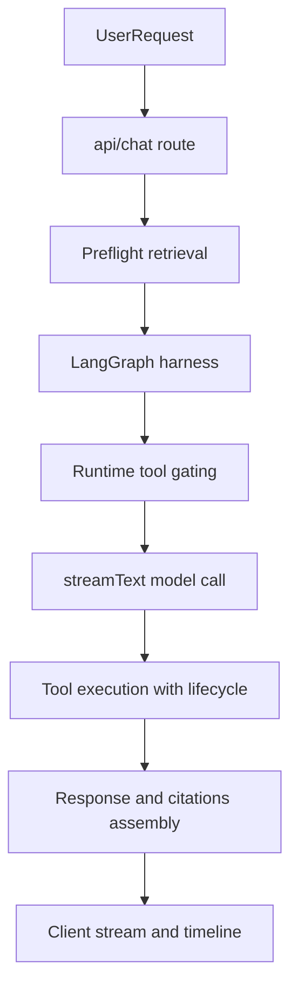
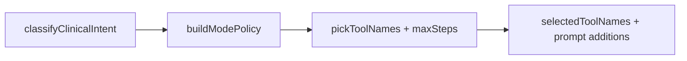

# Agent Routing Architecture

This document explains how the chat agent decides which tools to use, how LangGraph and LangChain fit together, and how fallback/reliability logic is applied.

## End-to-end flow

## LangGraph layer (planning and routing)

Files:
- [`lib/clinical-agent/graph/router.ts`](/Users/darius/Desktop/fleming/lib/clinical-agent/graph/router.ts)
- [`lib/clinical-agent/graph/harness.ts`](/Users/darius/Desktop/fleming/lib/clinical-agent/graph/harness.ts)
- [`lib/clinical-agent/graph/types.ts`](/Users/darius/Desktop/fleming/lib/clinical-agent/graph/types.ts)

The harness performs three core steps:

- `classifyClinicalIntent(...)` maps query text into an intent class.
- `selectConnectorPriority(...)` maps intent to connector order.
- `pickToolNames(...)` intersects connector-tool mappings with available runtime tools.
- In evidence fan-out mode, `pickToolNames(...)` force-includes core multi-source tools (PubMed, guideline, trials, Scholar Gateway, bioRxiv when available).
- `maxSteps` is computed from intent + tool count + artifact mode, with higher caps for fan-out retrieval.

## Runtime tool construction and gating

Primary runtime orchestration is in:
- [`app/api/chat/route.ts`](/Users/darius/Desktop/fleming/app/api/chat/route.ts)

Runtime tools are assembled from:
- web search tools
- evidence tools (PubMed/guideline/trials/etc.)
- connector tools
- optional YouTube/artifact tools

Then route-level gating is applied:
- Scholar Gateway is kept only when:
  - user explicitly asks for it (`scholar gateway`, `openalex`, `europe pmc`), or
  - evidence mode is enabled and freshness/comprehensiveness is requested, or
  - evidence appears sparse/monoculture.
- Otherwise it is removed from `runtimeTools` before model execution.

Default evidence behavior is now **balanced broad fan-out**:
- Trigger: evidence mode + non-artifact query.
- Target coverage: 4-6 distinct source families (balanced default: 5, freshness-biased: 6).
- Preferred first-pass tools: `pubmedSearch`, `guidelineSearch`, `clinicalTrialsSearch`, plus `scholarGatewaySearch` (and `bioRxivSearch` for freshness-heavy queries), with `webSearch` available when enabled.

This creates a two-layer control:
1. **LangGraph selection** (`selectedToolNames`)
2. **Route hard-gating** (final `runtimeTools` object)

## Model tool-calling behavior

The final model call uses `streamText(...)` with:
- `tools: runtimeTools`
- `maxSteps: resolvedMaxSteps`
- optional `toolChoice` for artifact workflows

Fan-out budgets are explicitly bounded:
- Per retrieval call timeout: ~3.5s baseline
- Total retrieval planning budget hint: ~12s balanced / ~14s freshness-heavy
- Step cap: 12 balanced / 14 freshness-heavy

Tool lifecycle events are wrapped around each `execute(...)`:
- `queued`
- `running`
- `completed` / `failed`

These events are emitted as timeline annotations and help debug tool choice and latency.

## Connector reliability and fallback

Connector execution path:
1. `runConnectorSearch(...)` primary connector call
2. degraded detection
3. narrowed-query retry
4. alternate connector(s)
5. web fallback (`searchWeb`) when configured

This is implemented in [`app/api/chat/route.ts`](/Users/darius/Desktop/fleming/app/api/chat/route.ts) via `executeConnectorWithFallback(...)`.

Citation synthesis applies diversity and recency controls:
- merged citations are ranked by query overlap + evidence strength + recency
- a source-diversity floor is enforced in fan-out mode so final citations are less likely to be PubMed-only when alternatives exist

## Web search reliability strategy

Core web search implementation:
- [`lib/web-search.ts`](/Users/darius/Desktop/fleming/lib/web-search.ts)

Current strategy:
- default timeout increased
- default `liveCrawl` uses cache-friendly mode
- route-level tool allows bounded second attempt:
  - retry only when first attempt is timeout/sparse
  - broader query on second attempt
  - max two tool calls per response

## Safety escalation behavior

Emergency guidance generation is controlled in:
- [`app/api/chat/route.ts`](/Users/darius/Desktop/fleming/app/api/chat/route.ts)

Behavior:
- Detect red flags and urgent context.
- Emit **soft safety guidance** by default for ambiguous risk.
- Emit **hard ED/911 wording** only for clearer high-risk patterns.

This keeps clinician/student outputs safety-aware but less alarmist for non-emergency academic queries.
